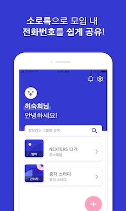
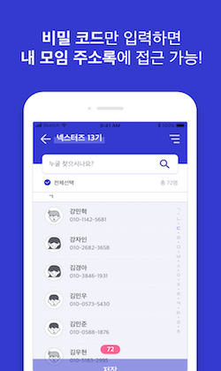
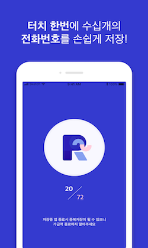

## (주)소로록 ☎️
여러명의 연락처를 한번에 공유하고 저장할 수 있는 주소록 서비스 

### 서비스 구상과정 
대표자 전화번호 취합 >
공유 공간 생성 >
번호 공유 >
가장 높은 허들 개별 저장

### 서비스 플로우구조
- 소로록 - 관리자 : 그룹생성 , 코드부여
- 소로록 - 멤버 : 번호 등록
- 관리자 - 멤버 : 코드 공유 (카카오톡, 단체문자 등)

### 

